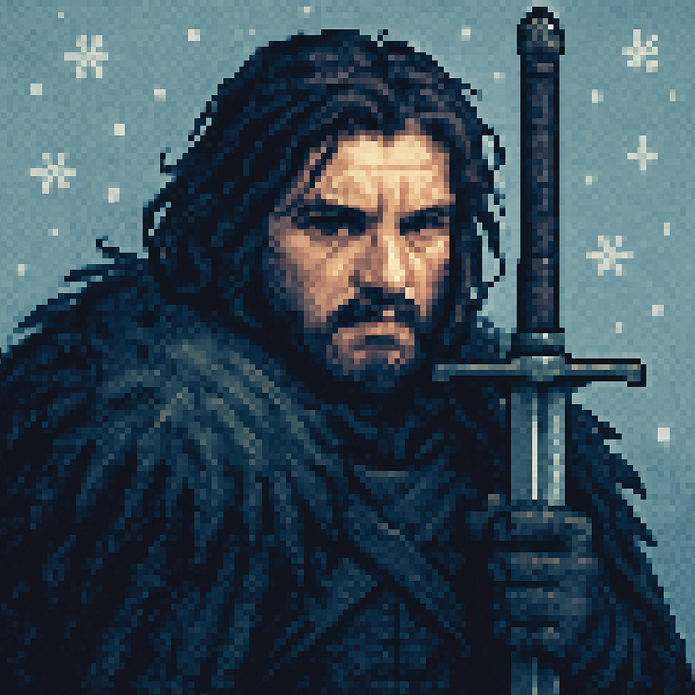

# 🔥 Roast Rumble --> AI comedians in. Epic roast battles out.

Welcome to **Roast Rumble** — a pixel-perfect web app that pits AI-powered parody characters against each other in hilarious roast battles. It's equal parts comedy generator, character showcase, and "oh snap, that's clever" entertainment machine.



---

## 🎯 Why this exists (and why it's actually hilarious)

* **Instant comedy gold.** Pick two characters → watch them absolutely destroy each other with AI-generated roasts. No waiting, no writer's block, just pure comedic chaos.
* **Character-driven humor.** Each AI comedian has a distinct personality (DumbleRoast the wizard, Jon Slow the brooder, Roast Vader the dramatic one) that shines through in their roasts.
* **Themed arenas.** Battle in the **Pixel Pro Slamdome**, **Heck's Kitchen**, or **Snarkham Asylum** — each with unique visual flair and color schemes.
* **Live hype meter.** Watch the battle momentum swing as each roast lands, with a visual meter that never settles for a draw.
* **Zero setup friction.** Click characters, pick arena, hit start → instant roast battle with professional-grade AI comedy.

---

## ✨ Features at a glance

* **8 Unique Characters:** From Harry Potter parodies to Star Wars legends, each with distinct roasting styles
* **3 Battle Arenas:** WWE ring, Hell's Kitchen, Arkham Asylum — each with pixel art backgrounds
* **AI Roast Engine:** Powered by Google Gemini, generates contextually aware, character-specific burns
* **Live Battle Flow:** Real-time roast generation with hype meter tracking
* **Responsive Design:** Pixel art aesthetic that works on desktop and mobile
* **Session Management:** Save your battle setup and revisit results

---

## 🎭 Meet the Roasters

**Wizarding World:** Albus DumbleRoast • Harry Hot-Take  
**Fantasy Realm:** Jon Slow (knows nothing, broods constantly)  
**Crime Drama:** Dexter Mockman (forensic roaster with dark humor)  
**Anime:** Monkey D. Laughy (stretchy pirate of punchlines)  
**Sci-Fi:** Roast Vader (dark lord of burns) • Thanos Snaps (cosmic mic dropper)  
**Comics:** Roastpool (mercenary with a mouthful of burns)

Each character has unique roasting angles based on their source material — expect Hogwarts jokes, "I know nothing" references, and plenty of rubber limb humor.

---

## 🏟️ Battle Arenas

* **Pixel Pro Slamdome:** Neon WWE vibes with electric blue and hot pink
* **Heck's Kitchen:** Fiery orange and gold kitchen chaos
* **Snarkham Asylum:** Purple and neon green Arkham atmosphere

---

## ⚙️ Quick Start

```bash
# Clone and setup
git clone <your-repo>
cd roast-rumble

# Install dependencies
pip install -r requirements.txt

# Set your Gemini API key
echo "GEMINI_API_KEY=your_key_here" > .env

# Run the app
python app.py
# open http://127.0.0.1:5000
```

**Battle Workflow**

1. **Disclaimer** → Accept the roast battle terms
2. **Select Players** → Pick two characters (can't pick the same one twice)
3. **Choose Arena** → Pick your battle theme and roast style
4. **Fight!** → Watch the AI comedians go at it with live roast generation
5. **Results** → See the final score, round-by-round breakdown, and winner

---

## 🗂️ Folder layout

```
roast-rumble/
├─ app.py                 # Main Flask app with battle flow
├─ requirements.txt       # Python dependencies
├─ services/
│  ├─ gemini_client.py   # Google Gemini AI wrapper
│  └─ roast_engine.py    # Battle logic and scoring
├─ presets/
│  ├─ personas.json      # Character definitions and bios
│  └─ themes.json        # Arena themes and color palettes
├─ templates/             # HTML battle flow pages
├─ static/
│  ├─ avatars/           # Character profile images
│  ├─ themes/            # Arena background images
│  ├─ css/               # Pixel art styling
│  └─ js/                # Battle interaction logic
```

**Key Routes:**
* **Disclaimer:** `/` (start here)
* **Player Selection:** `/select`
* **Arena Selection:** `/arena`
* **Battle:** `/fight`
* **Results:** `/results`

---

## 🔧 Tech notes (short & sweet)

* **Stack:** Flask + Google Gemini AI + Tailwind CSS via CDN
* **AI Model:** Gemini 2.0 Flash for roast generation
* **Styling:** Custom pixel art CSS with neon effects and retro fonts
* **State Management:** Flask sessions for battle flow
* **Deployment Ready:** Configured for 0.0.0.0 hosting (EC2 compatible)

**Dependencies:**
```
Flask==3.0.3
google-generativeai>=0.8.0
python-dotenv==1.0.1
```

---

## 🧩 Customize in 30 seconds

* **Add characters:** Edit `presets/personas.json` with new bios and avatar paths
* **New arenas:** Add themes to `presets/themes.json` with background images
* **Roast style:** Modify the `MASTER_PROMPT` in `gemini_client.py`
* **Battle length:** Change default rounds in `roast_engine.py`

---

## 🧯 Troubleshooting

* **No roasts generated?** Check your `GEMINI_API_KEY` in `.env`
* **Characters look broken?** Ensure avatar images exist in `static/avatars/`
* **Arena backgrounds missing?** Verify theme images in `static/themes/<theme>/`
* **Battle won't start?** Make sure you've selected different characters for A and B

---

## 🎮 How the Roast Engine Works

The AI generates roasts using a sophisticated prompt system that:
1. **Stays in character** — Each comedian maintains their unique voice
2. **Targets the opponent** — Roasts focus on the other character's quirks
3. **Respects the arena** — Optional theme tie-ins for extra flavor
4. **Keeps it punchy** — Maximum word limits for snappy delivery
5. **Scores dynamically** — Hype meter updates based on roast quality and randomness

The scoring algorithm considers punctuation, length, caps usage, and adds a dash of chaos for unpredictable battles.

---

## 📝 License

Opensource — remix it, ship it, roast your friends.

---

## 🙌 Credits

Crafted with ❤️ and 🤖 and a deep appreciation for AI that can actually be funny. Built on the shoulders of Google Gemini and pixel art aesthetics that never go out of style.

*"In the arena of comedy, there are no draws — only winners and those who got roasted harder."* 🔥
